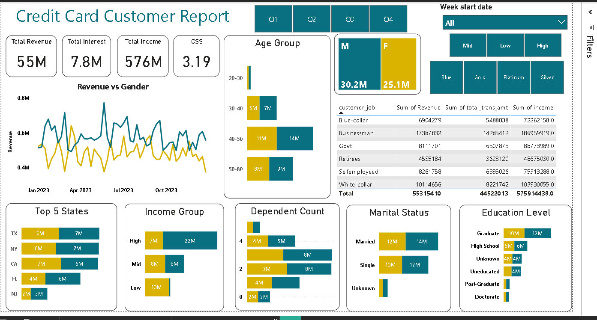
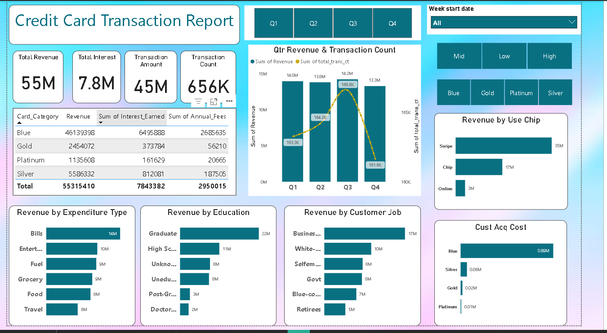

# Credit Card Analytics Dashboard (Power BI)

This project is an interactive, 2-page Power BI dashboard designed to analyze customer and transaction data for a credit card portfolio.

## Dashboard Pages

The report is split into two main pages:

### 1. Customer Report
This page focuses on customer demographics and segmentation.
* **Key KPIs:** Total Revenue ($55M), Total Interest ($7.8M), Total Income ($576M), and CSS (3.19).
* **Visualizations:** Analyzes revenue by Age Group, Income Group, Top 5 States, Marital Status, and Education Level.
* **Interactivity:** Includes slicers for filtering by Quarter, Week, Customer Job, and more.

### 2. Transaction Report
This page analyzes transaction-level data and spending patterns.
* **Key KPIs:** Total Revenue ($55M), Total Interest ($7.8M), Transaction Amount ($45M), and Transaction Count (656K).
* **Visualizations:** Tracks revenue by Card Category, Expenditure Type (Bills, Fuel, etc.), Customer Job, and transaction method (Chip, Swipe, Online).
* **Trend Analysis:** Includes a dual-axis combo chart to track quarterly revenue against transaction counts.

## How to Use

1.  Download the `.pbix` file from this repository.
2.  Open the file in Power BI Desktop to explore the full interactive dashboard.
